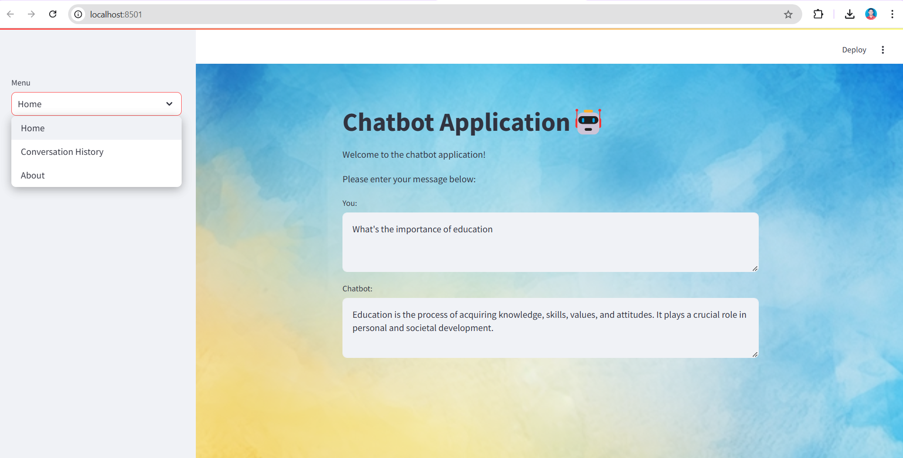

# Chatbot Application 🤖

Welcome to the Chatbot Application! This application allows users to interact with an AI chatbot, view conversation history, and explore additional features.

## 📸 Preview



## 🚀 Features
- AI-powered chatbot interaction.
- User-friendly interface with a navigation menu.
- Conversation history tracking.

## 🔧 Installation
1. Clone the repository:
   ```sh
   git clone https://github.com/yourusername/ChatbotApplication.git
   cd ChatbotApplication
